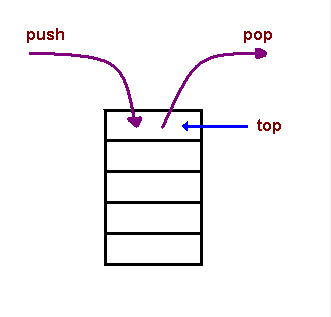

# Readings: In memory storage

## [Understanding the JavaScript Call Stack](https://www.freecodecamp.org/news/understanding-the-javascript-call-stack-861e41ae61d4)

* ***What is a ‘call’?***

  * call stack used for function invocation

* ***How many ‘calls’ can happen at once?***

  * one at a time front top to bottom

* ***What does LIFO mean?***

  * last in, first out

* ***Draw an example of a call stack and the functions that would need to be invoked to generate that call stack.***

  *  

* ***What causes a Stack Overflow?***

  * A stack overflow occurs when there is a recursive function (a function that calls itself) without an exit point

  ----

## [JavaScript error messages](https://codeburst.io/javascript-error-messages-debugging-d23f84f0ae7c)

* ***What is a ‘reference error’?***

  * This is as simple as when you try to use a variable that is not yet declared you get this type os errors.

* ***What is a ‘syntax error’?***

  * this occurs when you have something that cannot be parsed in terms of syntax, like when you try to parse an invalid object using JSON.parse.

* ***What is a ‘range error’?***

  * Try to manipulate an object with some kind of length and give it an invalid length and this kind of errors will show up.

* ***What is a ‘type error’?***

  * this types of errors show up when the types (number, string and so on) you are trying to use or access are incompatible, like accessing a property in an undefined type of variable.

* ***What is a breakpoint?***

  * line you selected was run you will be able to see what has happened before that point and you can try and evaluate the next lines to check if everything is outputting what you are expecting

* ***What does the word ‘debugger’ do in your code?***

  * by using `debugger`, you can creat a breakpoint

  ## Bookmark and Review

  [Javascrpit errors and reference on MDN](https://developer.mozilla.org/en-US/docs/Web/JavaScript/Reference/Errors)

  ## Things I want to know about:

  * as much as I can about debugging before next week!!