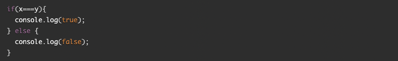

## Readings-React and Forms

## [React Docs-Forms](https://reactjs.org/docs/forms.html)

***What is a ‘Controlled Component’?***

* Controlled Components are those in which form’s data is handled by the component’s state.

***Should we wait to store the users responses from the form into state when they submit the form OR should we update the state with their responses as soon as they enter them? Why.***

* wait until submit, you dont want the form to refrersh everytime the user inputs a feild.

***How do we target what the user is entering if we have an event handler on an input field?***

* `event.target.value`

## [The conditional (Ternary) Operator Explained](https://codeburst.io/javascript-the-conditional-ternary-operator-explained-cac7218beeff)

***Why would we use a ternary operator?***

* its an alternative to an `if...else` staement

***Rewrite the following statement using a ternary statement:***

* 

* `x === y ? 'true' : 'false';`

## Bookamrk and Review

  [React Bootstrap-Forms](https://react-bootstrap.github.io/forms/overview/)

  [React Docs - conditional rendering](https://reactjs.org/docs/conditional-rendering.html)

  ## Things I want to know more about

  * ***I should read this material a couple of times to really understand it and retain it.***

