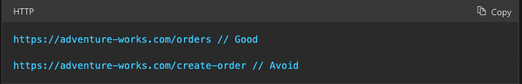

# Readings: APIs

## [API Design Best Practices](https://docs.microsoft.com/en-us/azure/architecture/best-practices/api-design)

***What does REST stand for?***

* Representational State Transfer

***REST APIs are designed around a ____.***

* resource

***What is an identifier of a resource? Give an example.***

* object, data, or service...like locationIQ

***What are the most common HTTP verbs?***

* `GET`, `POST`, `PUT`, `PATCH`, and `DELETE`

***What should the URIs be based on?***

* nouns (the resouce) not the verbs (operations on the resource)

***Give an example of a good URI.***

* 

***What does it mean to have a ‘chatty’ web API? Is this a good or a bad thing?***

* APIs that expose a large amout of small resources...you want to avoid

***What status code does a successful GET request return?***

* 200 (ok)

***What status code does an unsuccessful GET request return?***

* 404 (Not Found)

***What status code does a successful POST request return?***

* 201 (created)

***What status code does a successful DELETE request return?***

* 204 (no content)

## Bookmark and Review

* [RegExr - Pay particular attention to the cheatsheet](https://regexr.com/)
* [Regex Tutorial](https://medium.com/factory-mind/regex-tutorial-a-simple-cheatsheet-by-examples-649dc1c3f285)
* [Regex 101](https://regex101.com/)